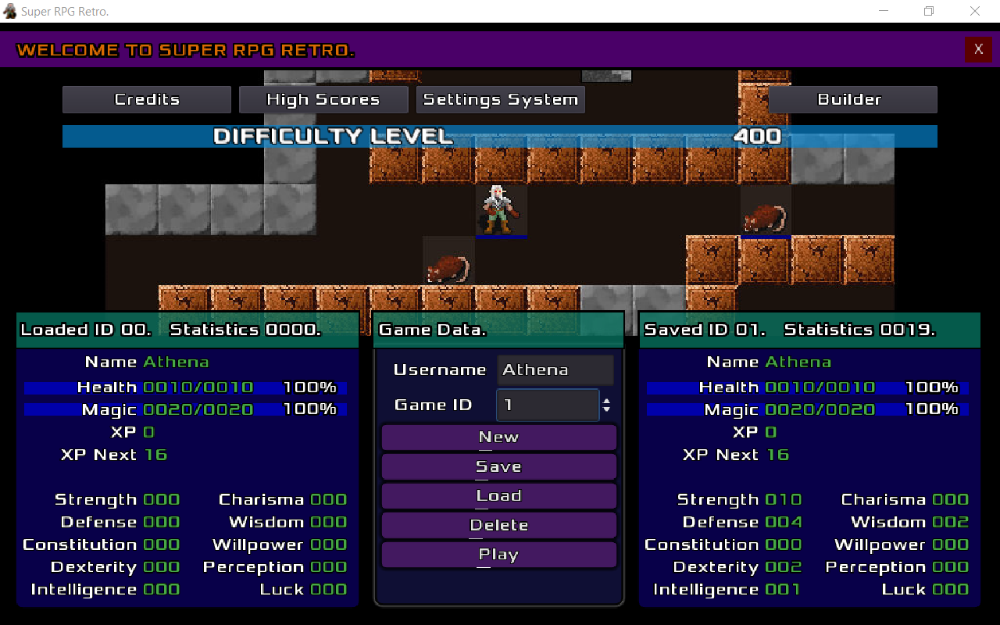
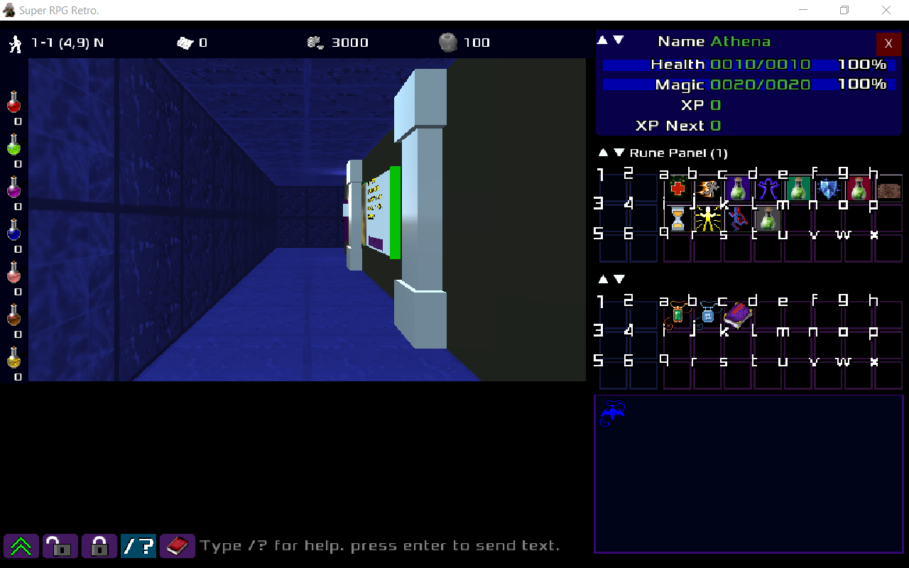
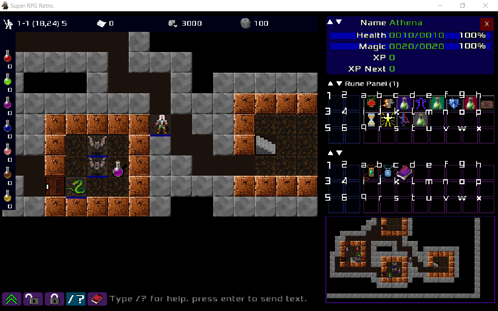
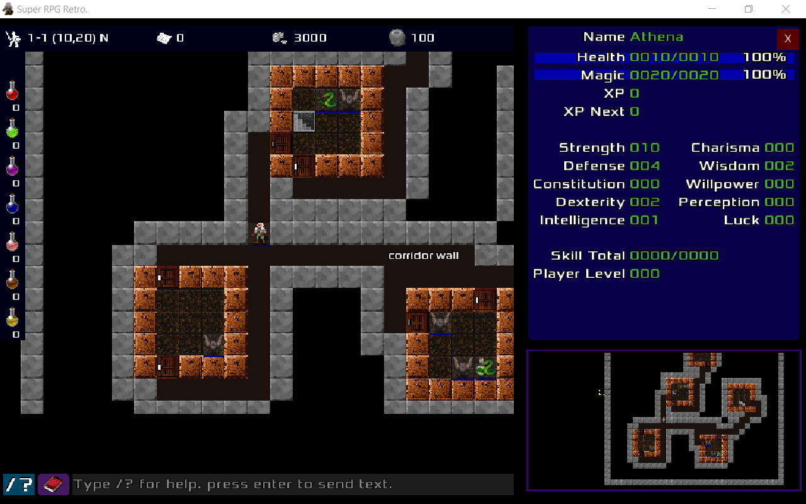

Procedurally Generated dungeons. Game inspired by Lufia 2 and legacy of the ancients.

### Summary
This game is currently a work in progress. Programmed in Godot 3.5. Help make this a great game. A team of volunteers needed. Join the [Super RPG Retro](https://discord.gg/b8damxvwX8) discord server. Get the [source code](https://github.com/Super-RPG-Retro/Super-RPG-Retro), and fork or contribute. The core of this game came from this video, building a Roguelike from Scratch in Godot, [Dungeon of Recycling](https://www.youtube.com/watch?v=vQ1UGbUlzH4). Music copyright Jim Paterson, https://www.mfiles.co.uk/. Used for Super RPG Retro with his permission.

* 61 magic. 999 maximum runes can be stacked for each magic.
* 460 item can be used at inventory.
* 678 mobs.
* 99 levels in every dungeon.
* 8 dungeons.
* Both 3d and 2d used in game.
* 10 player statistics such as str, def and luc.
* 999 is the maximum value of a statistic.
* 999 is the maximum level a player can have.
* 135 XP are needed for player level of 2.
* 14313772705 XP are needed for player level of 999.
* 9999 is the maximum value for both HP and MP.
* Game has a builder (construction kit) menu to customize game.
* Dungeon can be procedurally generated by using a seed.
* Set the game to use the same seed. 1000000000 available seeds.
* Enable music globally.
* Enable Sound globally.
* Enable wind and water drop sounds.
* Toggle size of the player stats panel.
* Show more of the main map by showing less of the client panel.
* Customize the client panel.
* Show guide images on map where a rune can be casted.
* Cast the rune at the main map or have instant rune casting.
* Hide the dungeon corridor stone walls?
* Try to show only the stone walls that parameter the corridor?
* Remove every one tile wide stone tile that borders the level.
* Should the graphics at the dungeon map be displayed larger?
* Higher value can increase the corridor distance between rooms.
* Every game can have a different "Difficulty level" value.
* Trigger events based on time. Dungeons can get dark at night.
* Game difficulty. 1: Easy. 5: Extremely difficult.
* On: Mobs chase when they see you: Off: Chase anytime.
* A black map hiding unexplored dungeon areas.
* Mobs are seen in room when room door is closed?
* Items are seen in room when room door is closed?
* Mobs are dead when they are this many units from their starting position.
* mobs will respawn after these many game turn elapses.
* mobs can run out of the room or stay in room.
* A black ceiling can be placed overtop of a dungeon room.
* Can use different floor tiles.
* Instant battle or turn based battle system.
* Can Show the down ladder when room ceiling is enabled.
* Option for player to return to last level or start of dungeon.
* Option to continue saved game.

### Installation.
users_dir = C:\Users\your_name\AppData\Roaming\Godot\app_userdata\Super RPG Retro client\
builders_dir = c:\super_rpg_retro\game\client\bundles

The first time you run the game, the save_data directory at users_dir is created. That directory has all game configurations in it. 

This game has a builders feature accessed from within the game. The builder feature is a game construction kit, also known as a game maker. That feature is accessed from the main menu of the game from a button called builder. You can create a dungeon that holds 99 levels, set room size for a dungeon level, set the corridor size for a level, set the amount of mobs in a dungeon, set the music for each scene and lots more.

At builder, most configuration files are saved using a game id as part of that filename. game_id can have a value of 1 to 8. You can have 8 different games to play. Currently only the first game id is used.

When the game loads, at splash scene, the game will look for the builder_dictionaires.txt file. That file holds all the .json data from the all file data at builder_dir. If that builder_dictionaires.txt file does not exist then at builders_dir\objects\system, all files within the images and data directories will be copied then saved in binary format to the following directories...

When you run the game, at the splash scene, a check will be made at the users_dir for configuration files. if no configuration files are found then the game will copy files from...
builder_dir\objects\system\images to builder_dir\objects\images\game_id_dir
builder_dir\objects\system\data to builder_dir\objects\data\game_id_dir
builder_dir\magic\system\data to builder_dir\magic\data\game_id_dir

Therefore, after you clone the game or unzip it to your game directory, verify that no game_id directories exist in these directories...
builder_dir\objects\images\
builder_dir\objects\data\
builder_dir\magic\data\

Failing to delete the above subdirectories will crash the game because no configuration files exist at users_dir and no files will be created at users_dir because the game_id folders exist.

Every time you add another magic to a .json file or every time you add or change a builder variable, you need to delete files from the users_dir and for game_id_dir all directories with that id number so that the correct data can be created at users_dir.

Builder system files are files that can be edited. Those files are copied then saved in binary format at splash scene. The system files are for the admin to create features while the binary files are for in game playing. Nobody can change a setting in the binary file so no cheating can be made. remove the system files from hard drive when the game in finished.

### Notes.
This software is using godot 3.5.
If game crashes, search for TODO and read everything.

A good practice to increase performance of your code:

var Peter:int = 0
notice the int instead of...
var Peter = 0 # slower

All dungeons are procedurally generated. However, levels will have the same layout if their room size and room number amount match.

you can do...
for "/" in string
or...
for _i in array
or...
for name in dictionary.

Sound jitters in html5 builds in edge browser. that issue should be fixed soon. just ignore the bug. only a few people are experiencing it. 

HTML5 needs a mouse click on screen before the title music plays. it is a browser security issue that will not change.

Mobs will never respawn if player is outside of room. mobs will only respawn when player is in that room and only after so many game turns have passed. You can see the game turns variable at Settings._game.respawn_turn_elapses. mobs will disappear if they are too far from their starting position.

Sound loops? select the ogg file at the godot filesystem tab than press import tab. Remove the loop option then press reimport. Next, drag the sound to AudioStreamPlayer node.

Load godot, go to project settings, search for compression then set all options to the highest value.

When printing something to scene using the print statement, add a hint to your code so that you know the file where the print output is from.

When importing 3d gridmap, enable detect 3d filter and mipmaps. 3d blocks that you use to draw on the map are stored in the blocksMuseum.tscn file.

### Notice.
This work is under the GNU Affero General Public License (AGPL).
   
   Notwithstanding any other provision of this License, if you modify the
Program, your modified version must prominently offer all users
interacting with it remotely through a computer network (if your version
supports such interaction) an opportunity to receive the Corresponding
Source of your version by providing access to the Corresponding Source
from a network server at no charge, through some standard or customary
means of facilitating copying of software.  This Corresponding Source
shall include the Corresponding Source for any work covered by version 3
of the GNU General Public License that is incorporated pursuant to the
following paragraph.

  THERE IS NO WARRANTY FOR THE PROGRAM, TO THE EXTENT PERMITTED BY
APPLICABLE LAW.  EXCEPT WHEN OTHERWISE STATED IN WRITING THE COPYRIGHT
HOLDERS AND/OR OTHER PARTIES PROVIDE THE PROGRAM "AS IS" WITHOUT WARRANTY
OF ANY KIND, EITHER EXPRESSED OR IMPLIED, INCLUDING, BUT NOT LIMITED TO,
THE IMPLIED WARRANTIES OF MERCHANTABILITY AND FITNESS FOR A PARTICULAR
PURPOSE.  THE ENTIRE RISK AS TO THE QUALITY AND PERFORMANCE OF THE PROGRAM
IS WITH YOU.  SHOULD THE PROGRAM PROVE DEFECTIVE, YOU ASSUME THE COST OF
ALL NECESSARY SERVICING, REPAIR OR CORRECTION.

  IN NO EVENT UNLESS REQUIRED BY APPLICABLE LAW OR AGREED TO IN WRITING
WILL ANY COPYRIGHT HOLDER, OR ANY OTHER PARTY WHO MODIFIES AND/OR CONVEYS
THE PROGRAM AS PERMITTED ABOVE, BE LIABLE TO YOU FOR DAMAGES, INCLUDING ANY
GENERAL, SPECIAL, INCIDENTAL OR CONSEQUENTIAL DAMAGES ARISING OUT OF THE
USE OR INABILITY TO USE THE PROGRAM (INCLUDING BUT NOT LIMITED TO LOSS OF
DATA OR DATA BEING RENDERED INACCURATE OR LOSSES SUSTAINED BY YOU OR THIRD
PARTIES OR A FAILURE OF THE PROGRAM TO OPERATE WITH ANY OTHER PROGRAMS),
EVEN IF SUCH HOLDER OR OTHER PARTY HAS BEEN ADVISED OF THE POSSIBILITY OF
SUCH DAMAGES.
