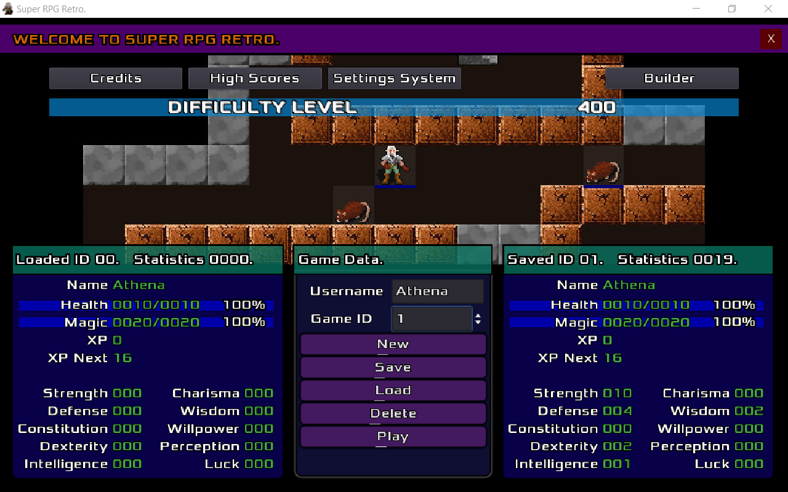

# [Home]() | [Screenshots](screenshots.md) | [Project Programming](project-programming.md) | [Legal Summary](legal-summary.md)

Join the Super RPG Retro [discord server](https://discord.gg/b8damxvwX8). Get the [source code](https://github.com/Super-RPG-Retro/Super-RPG-Retro), and fork or contribute.

  
This image shows the main menu.
    

  
Almost everything here can be customized.
    

  
An in-game construction kit called builder.
    

  
This scene can only be configured before a game is first saved.
    

  
These features can be changed anytime because they apply to the system, not individual game play.